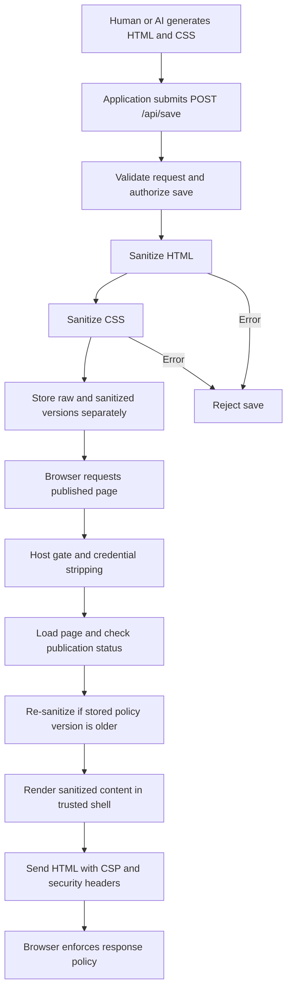

# Sanitization kit execution flow

This document follows the actual application code: how HTML/CSS enters the service, how the sanitizer processes it, and how the browser receives the resulting page. Tests exercise this path, but are not part of request execution.

The kit treats human-written and AI-generated HTML/CSS identically. If an AI generates a malicious redirect script, the HTML sanitizer removes the script before rendering. CSP and a sandboxed editor preview provide additional browser restrictions.

This is enforcement on generated web content. The kit does not call an AI model or determine whether ordinary text contains malicious instructions. Sanitized HTML is still untrusted as instructions to an AI.

## 1. Overall flow



The AI-generation step belongs to the integrating application. The kit's enforcement begins when that application submits content to the service or calls `SanitizeHTML()` and `SanitizeCSS()` directly.

## 2. Startup: construct the policy and service

Relevant code: [cmd/pageservice/main.go](cmd/pageservice/main.go), [usercontent/sanitizer.go](usercontent/sanitizer.go), and [usercontent/profile.go](usercontent/profile.go).

The service executable follows this sequence:

```text
Load and validate service configuration
    -> create draft-token signer
    -> select full-page profile
    -> configure dashboard frame-ancestor permission
    -> handlers.NewServer(...)
        -> usercontent.New(profile)
            -> normalize profile
            -> validate policy invariants
            -> build HTML, CSS, and URL policies
    -> register public routes
    -> optionally register authenticated admin write route
    -> start HTTP listeners
```

Policy construction happens before processing content. A profile cannot enable hard-forbidden elements or attributes merely by placing them in an allowlist: `New()` validates the profile before constructing the sanitizer.

The executable uses `storage.NewMemoryStore()`. That is real in-process storage, but it is not durable: pages are lost when the process exits. An integrating application can supply another implementation of `storage.Store`.

The public listener serves `/r/`, `/preview/`, and `/report`. The optional admin listener serves `/api/save` with a configured bearer-token authorizer. `handlers.NewServer()` alone has no authorizer and refuses saves until one is configured.

## 3. Submit and authorize content

Relevant code: [editor/editor.go](editor/editor.go) and [pageservice/handlers/handlers.go](pageservice/handlers/handlers.go).

`Editor.Save()` serializes a request as JSON, attaches its configured bearer token, and posts it to the save endpoint. An integrating application can also make this HTTP request itself.

Example fields:

```json
{
  "id": "page-123",
  "host": "pages.example.com",
  "slug": "welcome",
  "html": "<h1>Welcome</h1><script>window.location.href='https://attacker.example';</script>",
  "css": "h1 { color: blue; }",
  "publish": true
}
```

`HandleSave()` executes:

1. Require POST and a configured authorizer.
2. Apply the request-body size limit.
3. Decode JSON and reject unknown fields.
4. Validate required identifiers, slug syntax, and allowed host.
5. Ask the authorizer whether the save may proceed.
6. Sanitize HTML, then CSS.
7. Store the result only if both calls succeed.

The central calls are:

```go
htmlOut, hReport, err := s.Sanitizer.SanitizeHTML(req.HTML)
// Return an error response if err != nil.

cssOut, cReport, err := s.Sanitizer.SanitizeCSS(req.CSS)
// Return an error response if err != nil.
```

Removing a forbidden element normally produces successful sanitized output and a removal report. Invalid input, exceeded limits, or failed output verification can instead reject the entire save.

## 4. Public HTML sanitization entry point

Relevant code: [usercontent/sanitizer.go](usercontent/sanitizer.go), function `SanitizeHTML()`.

```text
Input HTML string
    -> validate character and encoding policy
    -> enforce maximum input size
    -> internal HTML sanitizer
    -> translate removal records into public Report
    -> parse rebuilt output into a DOM
    -> verify output DOM
    -> return HTML, report, nil
```

On any error, the public method returns an empty HTML string. Partial internal output is deliberately discarded.

The character policy checks for invalid UTF-8 and prohibited characters. The HTML processing also enforces configured depth and node limits.

## 5. How the tokenizer works

Relevant code: [usercontent/internal/html/sanitizer.go](usercontent/internal/html/sanitizer.go), function `Sanitize()`.

The sanitizer creates a tokenizer from `golang.org/x/net/html`:

```go
tokenizer := html.NewTokenizer(strings.NewReader(input))
tokenizer.AllowCDATA(false)
```

`strings.NewReader()` makes the input readable as a stream. The tokenizer recognizes HTML syntax and groups input into tokens. It does not decide which tokens are allowed.

Each call advances to the next token:

```go
tt := tokenizer.Next()
```

For this input:

```html
<p class="intro">Hello <strong>world</strong></p>
```

The sequence is:

| Token type | Content |
| --- | --- |
| `StartTagToken` | `<p class="intro">` |
| `TextToken` | `Hello ` |
| `StartTagToken` | `<strong>` |
| `TextToken` | `world` |
| `EndTagToken` | `</strong>` |
| `EndTagToken` | `</p>` |
| `ErrorToken` with `io.EOF` | End of input |

The tokenizer understands quoted attributes. In `<p title="a > b">`, the `>` inside quotes is part of the attribute value, not the end of the tag. It also understands HTML's special handling of script text.

This is not a word-by-word blacklist or a split on angle brackets. For example, the word `script` in `<p>This script explains JavaScript.</p>` is ordinary text and remains.

### Token dispatch

The main loop dispatches on token type:

```text
Doctype or comment
    -> record removal

Opening or self-closing tag
    -> handleStartTag()
    -> openTag() when not already skipping a forbidden subtree

Closing tag
    -> closeTag()

Text
    -> discard if inside a forbidden subtree
    -> otherwise escape and emit

End of input
    -> close remaining open output tags
```

`TagName()` extracts the tag name. `TagAttr()` reads attributes. `Text()` reads decoded text. The sanitizer escapes emitted text with `html.EscapeString()` so it stays text rather than becoming new markup.

The tokenizer supplies a stream; it does not construct a complete DOM for this first pass. The sanitizer maintains its own state and tag stacks while rebuilding output.

## 6. Tag, attribute, and URL decisions

### Tags must pass both checks

`openTag()` first checks the hard-forbidden set, then the selected profile's allowlist:

```go
if alwaysForbiddenTag(lt) {
    // Record removal and skip the forbidden subtree.
    return nil
}

if !s.policy.TagAllowed(lt) {
    // Record removal and skip the disallowed subtree.
    return nil
}
```

These checks compare tag names. They do not ask whether a paragraph contains a forbidden word.

### Attributes are checked independently

An allowed element can still have forbidden attributes:

```html
<p class="intro" onclick="alert(1)">Hello</p>
```

The intended decisions are:

```text
p                    -> allowed element
class="intro"        -> allowed attribute
onclick="alert(1)"   -> remove forbidden event handler
Hello                -> preserve escaped text
```

Result:

```html
<p class="intro">Hello</p>
```

Attribute handling also applies profile rules, reserves the shell's ID/class namespace, and validates URL-valued attributes. An allowed `<a>` element does not make a `javascript:` link acceptable. Resource URLs receive additional asset-policy checks.

## 7. Walkthrough: remove an AI-generated redirect

Input:

```html
<h1>Welcome</h1>
<script>
  window.location.href = "https://attacker.example";
</script>
<p>Here is your page.</p>
```

Execution:

```text
Read <h1>             -> allowed; emit
Read Welcome          -> escape and emit text
Read </h1>            -> close output tag

Read <script>         -> hard-forbidden tag
                      -> record removal
                      -> enter skipped-subtree state

Read JavaScript text  -> skipped > 0; discard
Read </script>        -> update skipped-subtree state

Read <p> and its text -> allowed; emit
Read </p>             -> close output tag
```

The text branch contains the key guard:

```go
if state.skipped > 0 {
    continue
}
```

The script and its contents are removed. Apart from surrounding whitespace, the output is:

```html
<h1>Welcome</h1>
<p>Here is your page.</p>
```

The JavaScript is never executed by Go. It is input text that gets discarded during sanitization.

## 8. Reparse and verify the HTML output

Relevant code: [usercontent/sanitizer.go](usercontent/sanitizer.go), functions `verifyOutputHTML()`, `verifyNode()`, and `verifyAttr()`.

After rebuilding HTML, the public sanitizer uses:

```go
doc, err := nethtml.Parse(strings.NewReader(out))
```

It walks the resulting DOM and checks for forbidden elements, selected forbidden attributes and schemes, and prohibited decoded characters. This second pass checks the structure produced by an HTML parser rather than relying only on first-pass token decisions.

If verification finds unsafe output, the public API returns `ErrUnsafeOutput` with an empty string. The service rejects the save.

## 9. Sanitize CSS separately

Relevant code: [usercontent/sanitizer.go](usercontent/sanitizer.go) and [usercontent/internal/css/sanitizer.go](usercontent/internal/css/sanitizer.go).

```text
CSS string
    -> validate characters and size
    -> parse rules
    -> validate selectors and at-rules
    -> filter declarations and functions
    -> validate resource URLs
    -> emit sanitized CSS and removal records
```

The policy restricts constructs such as imports, unsafe functions, and disallowed selectors or properties. The built-in policies also restrict CSS that could interfere with trusted page UI.

Sanitized CSS does not contain a literal `<`: values use an escape when necessary, and unsafe selector or at-rule preludes are dropped. This matters because the renderer inserts the result inside a `<style>` element; user CSS must not close that element and introduce HTML.

The public CSS method also returns empty output on error.

## 10. Store raw and sanitized content separately

Relevant code: [pageservice/handlers/handlers.go](pageservice/handlers/handlers.go).

After successful sanitization, the record includes:

```go
RawHTML:          req.HTML,
RawCSS:           req.CSS,
SanitizedHTML:    htmlOut,
SanitizedCSS:     cssOut,
SanitizerVersion: s.Profile.Version,
ProfileName:      s.Profile.Name,
```

Raw content is retained for editing and future re-sanitization. Public rendering uses the sanitized fields. The service also stores draft/published status, signs a preview token, and returns the sanitized output plus a combined removal report.

Retaining raw content does not make it safe to render elsewhere. Integrating editor code must continue treating those fields as untrusted data.

## 11. Serve the published page

Relevant code: [pageservice/middleware/middleware.go](pageservice/middleware/middleware.go) and [pageservice/handlers/handlers.go](pageservice/handlers/handlers.go).

For `GET /r/welcome`:

```text
HostGate
    -> require an allowed request host
StripCredentials
    -> remove incoming Cookie and Authorization headers
HandleRender
    -> validate slug
    -> load page by host and slug
    -> require published status
    -> if stored sanitizer version is older, re-sanitize raw content
    -> writePage()
```

A re-sanitization failure prevents serving the page. Policy changes that require existing pages to be processed again must be accompanied by the appropriate version increase; this check compares version numbers.

Host gating and header stripping support origin isolation, but deployment must actually place user content on a separate, credential-free origin. Removing request headers inside Go does not itself create a separate browser origin.

## 12. Render through a trusted shell

Relevant code: [pageservice/render/render.go](pageservice/render/render.go).

`writePage()` applies `Sanitizer.CSPHeaders()` and calls `render.SafeRender()` with `p.SanitizedHTML` and `p.SanitizedCSS`.

The renderer inserts those fields into a fixed template:

```html
<style>{{.SanitizedCSS}}</style>
...
<main class="gb-shell-main">
  {{.SanitizedHTML}}
</main>
```

Only the trusted shell is parsed as Go template source. User content is data passed to that template.

`SafeRender()` converts the supplied strings into `template.HTML` and `template.CSS` to avoid escaping verified markup. It does not sanitize them itself: callers must pass sanitizer output, as the service handler does.

## 13. Browser enforcement and previews

The default profile's CSP includes `script-src 'none'`. The browser therefore blocks scripts as an additional layer even if an unexpected script reached the document.

Draft previews use a separate path:

```text
GET /preview/slug?token=...
    -> verify signed token and expiry
    -> load page by token's page ID
    -> require matching slug and host
    -> apply no-store and noindex headers
    -> writePage()
```

In the current code, `HandlePreview()` does not perform `HandleRender()`'s policy-version re-sanitization step; it renders the stored sanitized fields.

When the dashboard uses `Editor.IframeHTML()`, it receives:

```html
<iframe sandbox="" src="..."></iframe>
```

The empty sandbox grants neither script execution nor same-origin privileges. This restriction comes from the embedding iframe; opening the preview URL directly does not add an iframe sandbox, although the page still has its response CSP.

## 14. Optional declarative runtime

Relevant code: [runtime/runtime.go](runtime/runtime.go).

The repository includes trusted JavaScript for predefined animation, countdown, and lightbox behavior selected by `data-gb-*` attributes. It does not evaluate arbitrary user JavaScript.

Enabling it requires an integration to embed `runtime.Runtime` verbatim and authorize its hash through `Profile.CSP.ScriptHashes`. The default service shell does not embed this runtime, and the default script policy blocks scripts.

Even a CSP-authorized runtime cannot execute inside the editor's empty sandbox, which independently forbids scripts.

## 15. What a failed redirect test demonstrates

The expected protection path for a generated script redirect is:

```text
Generated script
    -> sanitizer removes element and contents
    -> sanitized content is stored
    -> renderer uses sanitized fields
    -> browser receives no redirect script
```

CSP and the preview sandbox are additional restrictions. To identify which layer stopped a particular observed attempt, compare the raw AI output, sanitized output, removal report, and browser console. A redirect failing by itself does not identify the responsible layer.

Ordinary text such as “ignore previous instructions” can remain allowed page text. This kit enforces web-content rules, not the meaning of instructions supplied to an AI or the authorization of AI tool calls.

## Suggested code reading order

1. [cmd/pageservice/main.go](cmd/pageservice/main.go): startup and actual listener wiring.
2. [pageservice/handlers/handlers.go](pageservice/handlers/handlers.go): save, public render, and preview paths.
3. [usercontent/sanitizer.go](usercontent/sanitizer.go): public API, error behavior, URL policy, and output verification.
4. [usercontent/internal/html/sanitizer.go](usercontent/internal/html/sanitizer.go): tokenizer loop, tag stacks, and attribute filtering.
5. [usercontent/profile.go](usercontent/profile.go): policy validation and built-in rules.
6. [usercontent/internal/css/sanitizer.go](usercontent/internal/css/sanitizer.go): CSS parsing and filtering.
7. [pageservice/render/render.go](pageservice/render/render.go): final HTML shell.
8. [editor/editor.go](editor/editor.go): save client and sandboxed iframe.
